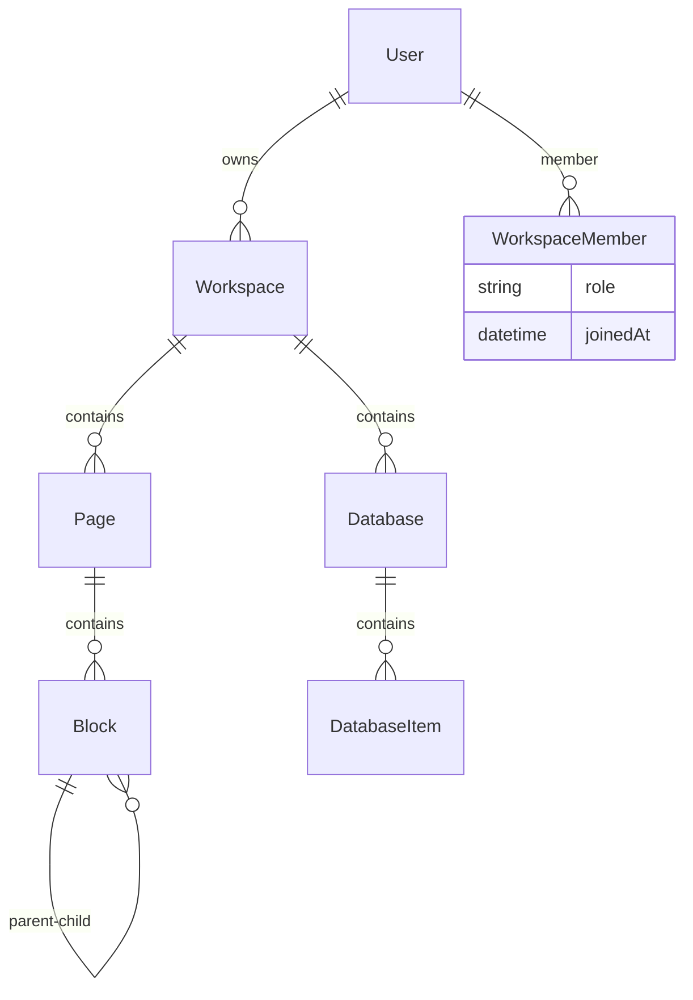

# Notion-Like App Backend Planning Document

## Overview
This document outlines the architectural plan for building a Notion-like application backend from scratch. The backend will be built using NestJS with TypeORM for database management, PostgreSQL as the database, and JWT for authentication. We'll start with the core entities and gradually add features for pages, blocks, databases, and collaboration.

## Technology Stack
- **Framework**: NestJS (Node.js)
- **Database**: PostgreSQL with TypeORM
- **Authentication**: JWT with Passport
- **Validation**: class-validator and class-transformer
- **Testing**: Jest
- **Documentation**: Swagger (to be added)
- **Real-time**: WebSocket + Redis Pub/Sub (for horizontal scalability)
- **Infrastructure**: Kubernetes / Docker / Nginx / Grafana

## Core Architecture
The application follows a modular architecture with clear separation of concerns:

### Database Schema Overview

### Module Structure
- **Auth Module**: User registration, login, JWT handling
- **User Module**: Profile management, settings
- **Workspace Module**: CRUD operations, member management
- **Page Module**: Page CRUD, hierarchy management
- **Block Module**: Block types, content management
- **Database Module**: Table creation, data management
- **File Module**: Upload and media handling
- **Search Module**: Content indexing and search
- **Realtime Module**: WebSocket for collaboration

## API Design Principles
- RESTful endpoints with consistent naming
- JSON API format for responses
- Proper HTTP status codes
- Pagination for list endpoints
- Input validation using DTOs
- Error handling with custom exceptions

## Security Considerations
- JWT token-based authentication
- Password hashing with bcrypt
- Role-based access control (RBAC)
- Rate limiting
- Input sanitization
- CORS configuration
- HTTPS enforcement in production

## Detailed Implementation Roadmap

### Phase 1: Foundation (Weeks 1-2)
1. **Database Setup & Core Entities**
   - Configure PostgreSQL connection with TypeORM
   - Define User entity with authentication fields
   - Create Workspace entity with basic properties
   - Set up Page entity with hierarchical structure
   - Implement Block entity with different block types
   - Define Database entity for Notion-like tables
   - Create WorkspaceMember entity for permissions
   - Set up initial database migrations

2. **Authentication System**
   - Implement JWT strategy with Passport
   - Create registration endpoint with email validation
   - Build login endpoint with password verification
   - Add password hashing with bcrypt
   - Implement refresh token functionality
   - Create auth guards for protected routes

### Phase 2: Core Features (Weeks 3-6)
3. **User Management**
   - Profile CRUD operations
   - User settings and preferences
   - Avatar upload functionality
   - Email verification system

4. **Workspace Management**
   - Create workspace endpoint
   - Invite users with role assignment
   - Workspace settings and customization
   - Member role management (admin, editor, viewer)
   - Workspace deletion with data cleanup

5. **Page System**
   - Page CRUD operations
   - Hierarchical page structure (parent-child relationships)
   - Page templates
   - Page sharing and permissions
   - Page archiving and restoration

6. **Block System**
   - Core block types: text, heading, list, image
   - Block CRUD operations
   - Block ordering and positioning
   - Rich text formatting
   - Block type conversions

### Phase 3: Advanced Features (Weeks 7-10)
7. **Database/Table Functionality**
   - Create database (table) endpoint
   - Define custom properties (text, number, date, select, etc.)
   - Database item CRUD operations
   - Filtering and sorting capabilities
   - Database views and filters

8. **Real-time Collaboration**
   - WebSocket gateway setup
   - Redis pub/sub for horizontal scaling
   - Live editing indicators
   - Conflict resolution for concurrent edits
   - Real-time presence indicators

9. **File & Media Handling**
   - File upload with validation
   - Image processing and optimization
   - Cloud storage integration (S3/Google Cloud)
   - Media management and organization

### Phase 4: Enhancements (Weeks 11-12)
10. **Search & Discovery**
    - Full-text search across content
    - Content indexing with Elasticsearch
    - Advanced filtering options
    - Search suggestions and autocomplete

11. **API Documentation & Quality**
    - Swagger/OpenAPI documentation
    - Comprehensive endpoint testing
    - API versioning strategy
    - Rate limiting implementation

12. **Security & Performance**
    - Input validation and sanitization
    - Rate limiting and DDoS protection
    - Data encryption for sensitive fields
    - Performance optimization and caching

### Phase 5: Production & Monitoring (Week 13)
13. **Infrastructure Setup**
    - Docker containerization
    - Kubernetes deployment configuration
    - Nginx reverse proxy setup
    - Database migrations and seeding

14. **Monitoring & Observability**
    - Application logging with Winston
    - Grafana dashboards for metrics
    - Error tracking and alerting
    - Performance monitoring

## Technical Specifications

### Database Schema Details
- **User**: id, email, password_hash, first_name, last_name, avatar_url, created_at, updated_at
- **Workspace**: id, name, description, owner_id, created_at, settings
- **WorkspaceMember**: workspace_id, user_id, role, joined_at
- **Page**: id, workspace_id, title, parent_id, created_by, created_at, updated_at, is_archived
- **Block**: id, page_id, type, content, position, parent_block_id, created_by, created_at
- **Database**: id, workspace_id, name, description, properties (JSON), created_by, created_at
- **DatabaseItem**: id, database_id, properties (JSON), created_by, created_at, updated_at

### Block Types
- Text Block: Plain text with formatting
- Heading Block: H1, H2, H3 with styling
- List Block: Bulleted, numbered, todo lists
- Image Block: Image upload with captions
- Code Block: Syntax highlighting
- Quote Block: Styled quotes
- Divider Block: Visual separators
- Table Block: Simple tables
- Embed Block: External content embedding

### Authentication Flow
1. User registers with email/password
2. Email verification sent
3. User logs in, receives JWT access token and refresh token
4. Access token used for API calls
5. Refresh token used to get new access token when expired

### Real-time Architecture
- WebSocket connections managed per workspace
- Redis pub/sub for broadcasting changes across instances
- Operational transformation for conflict resolution
- Presence indicators for active users

## Risk Assessment & Mitigations

### Performance Risks
- **Large workspace handling**: Implement pagination, lazy loading
- **Concurrent editing conflicts**: Use operational transforms
- **Database query optimization**: Add proper indexing, query optimization

### Security Risks
- **Data breaches**: Implement encryption, regular security audits
- **Unauthorized access**: Role-based permissions, JWT validation
- **Rate limiting**: Implement throttling to prevent abuse

### Scalability Risks
- **User growth**: Design for horizontal scaling from day one
- **Data volume**: Use efficient storage strategies, archiving
- **Real-time load**: Redis clustering, WebSocket optimization

## Success Metrics
- API response times < 200ms for 95% of requests
- Support for 1000+ concurrent real-time users
- 99.9% uptime in production
- Full feature parity with basic Notion functionality

## Deployment Considerations
- Docker containerization
- Environment-specific configurations
- Database migrations
- Monitoring and logging
- Scalability considerations (Redis for sessions/cache)

## Next Steps
1. Review and approve the todo list
2. Start with database setup and core entities
3. Implement authentication
4. Gradually build out features following the roadmap

This plan provides a solid foundation for building a robust Notion-like backend. We'll iterate on this plan as we discover additional requirements during implementation.